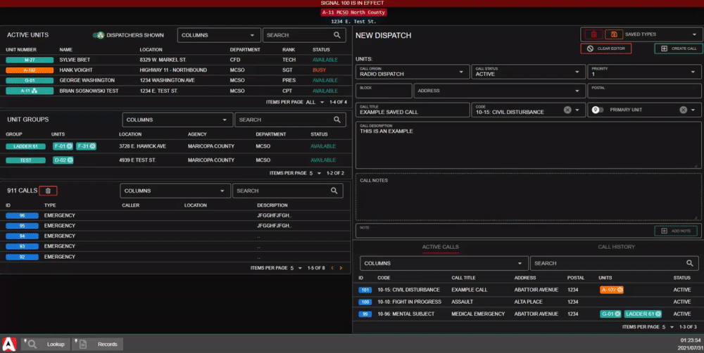

# Tone Board


The tone board is limited based upon your community's version.\
For more information, see our [pricing](../../pricing/faq/) or view how to check your community [limits](../getting-started/view-your-limits.md).


## Customizing Tones

### 1. Access the Customization Menu

In the admin page, navigate to `Customization` > `Customization` > `Tone Board`

.png>)

### 2. Uploading Tones

#### Direct Upload

You can upload .mp3, .wav, and .mp4 files directly to the CAD with the **plus** version.

.png>)

#### External Upload

If your community is not on the plus version or higher, you will need to link your tone from an external URL. You can upload to a website or file store of your choosing, but it must be a direct link ending in the file extension (.mp3, .mp4, .wav).

You can even use something as easy as Discord.

1. Upload your tone file to Discord in any chat
2. Right click on the file name or download button
3. Select `Copy Link`
4. Paste the direct URL into Sonoran CAD

Your direct link will look something like this:\
`https://cdn.discordapp.com/attachments/12345/abc123/signal_100.mp3`

### 3. Customize the Available Tones

Here, you can add new tones and specify the following:

* Tone Label
* Tone Link/URL (Direct uploading available based on your [version](../../pricing/faq/))
* Tone Button Color (Hex)
* Tone Button Icon

#### Tone Icons

Tone buttons support icons from several different web libraries. Clicking the search icon will open the [Font Awesome icon library](https://fontawesome.com/v5.15/icons) search. Here, you can search for an icon - click on it - and paste the icon name into the CAD. You can also use [material theme icons](https://fonts.google.com/icons).

.png>)

#### Save your Tones

Don't forget to press save!

## Selecting the Tone "Play To" Groups

The tone board can be set to play tones for specific identifiers, groups, agencies, departments, subdivisions, and dispatch calls.

You can click on any one of these items and select "Tone Board" to add this group to the play target on the tone board.

## Playing Tones as Dispatch

### Opening the Tone Board Window

The tone board can be opened by users in dispatch or self-dispatch mode.

From the start menu, this panel is located under `Dispatch` > `Tone Board`&#x20;

This window can also be opened via a [custom hotkey](../other-features/configurable-hotkeys.md), also supported with our [Streamdeck Integration](../../integration-plugins/stream-deck-integration.md).

The window can also be minimized, and [pinned to the taskbar](customizing-your-layout.md#7-tab-system) on your screen for quick access.

### Tone Board Shortcuts

The tone board is designed to be as efficient as possible.

#### Search Filtering

The top of the tone board includes a search box, allowing you to quickly filter tone options as you type.\
If you filter down the options to a single tone, the search label will turn green - allowing you to press `ENTER` to play the tone.

The tone board is also designed to auto-focus this search box whenever it is opened, or the header is clicked.

.png>)

#### Hotkey Auto-Window

[Global hotkeys](../other-features/configurable-hotkeys.md) allow you to open the tone board in a more advanced way. Opening the tone board with your [keyboard ](../other-features/configurable-hotkeys.md)or [Streamdeck ](../../integration-plugins/stream-deck-integration.md)shortcut will first check for any existing tone board window opened or minimized. If one is found, that existing window will be opened and focused to the search bar. Otherwise, a new tone board window will be opened with the search box focused.

#### Manual Tone Select

Instead of using the search box filtering, users can also manually click the tone board button to play the audio.

